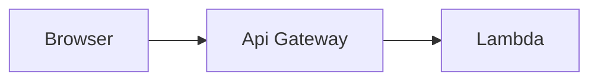

# Fuzzy Name Matching Serverless Backend

AWS Lambda Custom Runtime with Rust 1.42.0 exposed via API Gateway.


##  Features:

- POST /name_match_rust
    ```json
    {
        "queryName":"John Doe",
        "against": ["James Doe"]
    }
    ```
# Archtecture


# Quickstart

## Note

Building executable compatible with AWS Lambda environment can be a bit tricky. It is advisable to use [cross](https://github.com/rust-embedded/cross) crate for compilation.

1. Target executable for `x86_64-unknown-linux-musl`
    ```
    cross build --release --target x86_64-unknown-linux-musl
    ```
2. For custom runtime, AWS lambda looks for executable named `bootstrap`. So rename the executable and zip it.
    ```
    zip -j target/x86_64-unknown-linux-musl/bootstrap lambda.zip
    ```
3. Upload to AWS Lambda.
